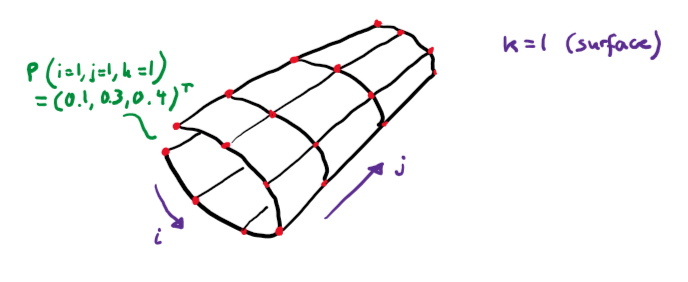

# StructuredGrid.jl

Package to handle scalar and vector fields represented as structured grids.

Example of a vector field (coordinates of a surface):

 </img>

## Conventions

* Access to data via `grid(:,i,j,k)`
* Surfaces are defined by keeping the size of the k-th direction to 1
